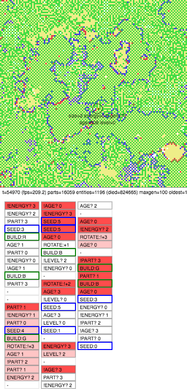

# Square Genes - A Life Simulator

As long as there are empty spaces, random genes are created, given a bit of
energy, and a nucleus that decodes their instructions.

For genes to stay around. They must copy themselves as all nuclei will die of
old age eventually. To do that, they must find energy, or run out and starve.

Most genes wont't make it. But few find a way. And with every copy perhaps
mutate and find even better ways to stay around. Slowly life grows. And after a
while, but inevitably, the simulator will be teeming with life.

The thing to note, this simulator only provides a few things:

1. an enviroment with rules
2. an implementation of how genes are to be interpreted
3. as genes ask for a copy, mutate the copy (how much depends on the ask)
4. on empy spaces, create random genes with some energy

From there genes are on their own. Natural selection emerges because genes
might copy. And only those that do, and do well, stay around.

The system uses squares, so that it can simulate many parts and many genes at
once. Parts of entities do not need to be fully connected, yet share all
energy. (Again for speed.)

Green parts harvest energy slowly from the environment. Red can eat green (and
nuclei) and release energy quickly. Blue can eat red.

Usually over time, larger entities will learn to use red/blue as a defensive
border. A cell wall if you like.

You can see the genes at work by clicking on a part. A visual of the gene will
appear at the right side (or bottom) of the screen. The more red, the more an
instruction was activated in the recent past. For what the genes encode for, read
the source of squaregenes.js.

see my blog post about this: http://leverlabs.io/blog20160714/

* author: Onne Gorter
* license: MIT

